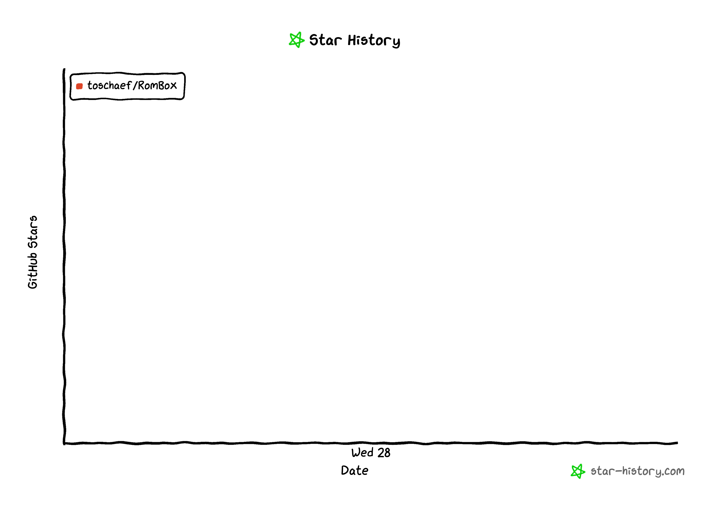

# Installation:

[Download RomBox](https://github.com/toschaef/RomBox/releases/download/untagged-43ad98062780f31632a9/rombox-darwin-arm64-0.9.5.zip)

### Quick Start

1. Install/Open RomBox
2. Drag and drop your game/BIOS files
3. Click on the cover to launch

### Disclaimers

RomBox is currently in early access and is only supported on Apple Silicon (ARM) MacOS

RomBox is an open-source frontend and is not affiliated with, nor authorized, endorsed, or licensed in any way by any console manufacturers or game developers. All trademarks are the property of their respective holders.

RomBox does not come bundled with any copyrighted game files or BIOS images. Users are responsible for providing their own files, which should be **legally** dumped from their own physical hardware and media.

# Setup

**IMPORTANT** - RomBox creates copies of the files installed onto it, so keep that in mind your disk space could fill up quickly with large games. I suggest keeping your games on an external drive, to avoid them taking up twice as much necessary space.

To install games and BIOSes, drag and drop your aquired files anywhere on the application. The accepted game file extentions and BIOS filenames are described below.

RomBox will accept raw files, directories, or archives. Directories and archives can include both games and BIOSes, and it will install all the same.

### Games

Games can be launched, renamed and deleted in the Library window, and are installed by dragging the file(s) onto the application. To launch a game, click on the cover, or default card if RomBox fails to fetch the cover.

Rombox automatically caches game's save files, so state should persist on reinstallation. Right now this is unsupported on 3DS. You can manually delete a game's save data in the submenu on the bottom right of the cover.

| Console | Expected File Extensions | Emulator Supported |
| --- | --- | --- |
| NES | `.nes`, `.unf` | Mesen2 |
| SNES | `.snes`, `.sfc`, `.smc` | Mesen2 |
| GameGear | `.gg` | Mesen2 |
| Sega Master System | `.sms` | Mesen2 |
| PC Engine | `.pce`, `.sgx` | Mesen2 |
| Game Boy | `.gb` | Mesen2 |
| Game Boy Color | `.gbc` | Mesen2 |
| Game Boy Advance | `.gba` | Mesen2 |
| N64 | `.N64`, `.z64`, `.v64` | Ares |
| Nintendo DS | `.nds` | MelonDS |
| Nintendo 3DS | `.3ds`, `.cia`, `.cxi` | Azahar |
| GameCube | `.iso`, `.rvz` | Dolphin |
| Wii | `.iso`, `.rvz` | Dolphin |
| PS1 | `.iso`, or `.bin` and `.cue` in a directory | DuckStation |
| PS2 | `.iso`, `.chd` | PCSX2 |

### BIOSes

BIOSes can be viewed and deleted in the BIOS window, and are installed by dragging the file(s) onto the application.

| Console | Expected BIOS Filename | Required |
| --- | --- | --- |
| SNES | `dsp1.rom` `dsp1b.rom` `dsp2.rom` `dsp3.rom` `dsp4.rom` `st010.rom` `st011.rom` | Required for some games |
| Game Boy Advance | `gba_bios.bin` | Yes |
| Nintendo DS | `bios7.bin` `bios9.bin` `firmware.bin` | Yes (All) |
| Nintendo 3DS | Install your `user` directory uploaded from your 3DS | No |
| PS1 | `scph1001.bin` `scph5500.bin` `scph5501.bin` `scph5502.bin` `scph7502.bin` `ps1_bios.bin` | Yes (One) |
| PS2 | `scph10000.binn` `scph39001.bin` `scph70012.bin` `scph77001.bin` `scph39004.bin` `bios.bin` `ps2_bios.bin` | Yes (One) |

### Controls

Setup your controls in the Controls window. Click on the control you want to bind to, and RomBox will listen for the next keypress or controller input. When binding to the standard layout, each keybind is applied to the specific console by default. Once you make changes to a console specific layout, changes to the standard layout will stop updating said console's bindings. 

You can create, delete, and rename new profiles on the top bar with their associated buttons. The profile currently selected in the Controls page will be applied to launched games, however, changing the selected profile in RomBox will not re-configure the associated emulator without relaunching the game.

### Settings

In the settings menu, you can delete all of your game files, along with engines/save data. You can also toggle automatically installing engines (emulators), which is on by default.

# Limitations

Currently, controller inputs do not work on GameCube and Wii, and no inputs work on N64. TBH I will probably never get around to this. You can still use RomBox to play games on these consoles, but you will have to manually setup the controls in the associated emulator's menu.

## Known Issues:

Install modal persists on install error

GroupBindingCard doesnt prevent event defaults (page scrolling on arrow key/space binds)

Azahar doesnt configure controller controls unless controller is connected on launch

Azahar has update popup on launch

### Possibly Upcoming:

general settings (fullscreen, resolution)

local multiplayer

save caching for 3ds, wii, n64

controller support on gc/wii, N64

keyboard support on N64

ui improvement

more consoles

emulator specific settings

theme customization

controller options per console

