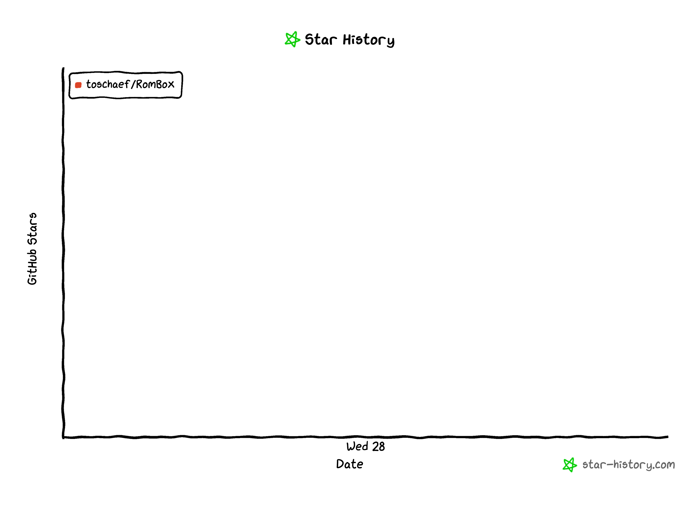

# Installation:

[Download RomBox](https://github.com/toschaef/RomBox/releases/latest)

### Quick Start

1. Install/Unzip RomBox
2. Move it to `/Applications/` and sign with `xattr -cr /Applications/rombox.app`
3. Drag and drop your game/BIOS files
4. Click on the cover to launch

### Disclaimers

RomBox is currently in early access and is only supported on Apple Silicon (ARM) MacOS

I don't pay for an Apple Developer Certificate, so you must sign it with `xattr -cr /Applications/rombox.app` (after moving it to `/Applications/`)

RomBox is an open-source frontend and is not affiliated with, nor authorized, endorsed, or licensed in any way by any console manufacturers or game developers. All trademarks are the property of their respective holders.

RomBox does not come bundled with any copyrighted game files or BIOS images. Users are responsible for providing their own files, which should be **legally** dumped from their own physical hardware and media.

# Setup

**IMPORTANT** - RomBox creates copies of the files installed onto it, so keep that in mind your disk space could fill up quickly with large games. I suggest keeping your games on an external drive, to avoid them taking up twice as much necessary space.

To install games and BIOSes, drag and drop your aquired files anywhere on the application. The accepted game file extentions and BIOS filenames are described below.

RomBox will accept raw files, directories, or archives. Directories and archives can include both games and BIOSes, and it will install all the same.

### Games

Games can be launched, renamed and deleted in the Library window, and are installed by dragging the file(s) onto the application. To launch a game, click on the cover, or default card if RomBox fails to fetch the cover.

Rombox automatically caches game's save files, so state should persist on reinstallation. Every supported console is covered, including the ones whose emulators don't store saves as one file per ROM: GameCube memory cards (raw images and GCI folders), the Wii NAND, the 3DS SD card, and PS1/PS2 memory cards are cached as a whole. Save states are cached too. Saves are backed up when a game exits and again before a game is deleted, and restored on launch — a save the emulator wrote more recently than the backup is never overwritten.

You can manually delete a game's save data in the submenu on the bottom right of the cover. Memory cards and NANDs that several games share are kept, since deleting them would take other games' progress with them.

**Importing saves.** The same submenu has an Import Save option, which takes either a single save file or a RomBox save archive. Every file is verified before anything is written — a PS1 memory card has to pass the checksums on all sixteen of its directory frames, a GameCube save's header has to declare the same block count as its length, a PS2 card has to carry Sony's header and be a real card size, and a cartridge save has to be a size a save chip actually comes in. Files that cannot be proven valid are refused with the reason, and nothing is written unless the whole import verifies.

Imported saves are renamed to the game they were imported onto, so a save from someone else's library is picked up correctly. Anything an import replaces is copied to `saves/_replaced/` first, so it can be put back by hand. A save exported from RomBox can always be imported again.

| Console | Expected File Extensions | Emulator Supported |
| --- | --- | --- |
| NES | `.nes`, `.unf` | Mesen2 |
| SNES | `.snes`, `.sfc`, `.smc` | Mesen2 |
| GameGear | `.gg` | Mesen2 |
| Sega Master System | `.sms` | Mesen2 |
| PC Engine | `.pce`, `.sgx` | Mesen2 |
| Game Boy | `.gb` | Mesen2 |
| Game Boy Color | `.gbc` | Mesen2 |
| Game Boy Advance | `.gba` | Mesen2 |
| N64 | `.N64`, `.z64`, `.v64` | Ares |
| Nintendo DS | `.nds` | MelonDS |
| Nintendo 3DS | `.3ds`, `.cia`, `.cxi` | Azahar |
| GameCube | `.iso`, `.rvz` | Dolphin |
| Wii | `.iso`, `.rvz` | Dolphin |
| PS1 | `.iso`, or `.bin` and `.cue` in a directory | DuckStation |
| PS2 | `.iso`, `.chd` | PCSX2 |

### BIOSes

BIOSes can be viewed and deleted in the BIOS window, and are installed by dragging the file(s) onto the application.

| Console | Expected BIOS Filename | Required |
| --- | --- | --- |
| SNES | `dsp1.rom` `dsp1b.rom` `dsp2.rom` `dsp3.rom` `dsp4.rom` `st010.rom` `st011.rom` | Required for some games |
| Game Boy Advance | `gba_bios.bin` | Yes |
| Nintendo DS | `bios7.bin` `bios9.bin` `firmware.bin` | Yes (All) |
| Nintendo 3DS | Install your `user` directory uploaded from your 3DS | No |
| PS1 | `scph1001.bin` `scph5500.bin` `scph5501.bin` `scph5502.bin` `scph7502.bin` `ps1_bios.bin` | Yes (One) |
| PS2 | `scph10000.binn` `scph39001.bin` `scph70012.bin` `scph77001.bin` `scph39004.bin` `bios.bin` `ps2_bios.bin` | Yes (One) |

### Controls

Setup your controls in the Controls window. Click on the control you want to bind to, and RomBox will listen for the next keypress or controller input. When binding to the standard layout, each keybind is applied to the specific console by default. Once you make changes to a console specific layout, changes to the standard layout will stop updating said console's bindings. 

You can create, delete, and rename new profiles on the top bar with their associated buttons. The profile currently selected in the Controls page will be applied to launched games, however, changing the selected profile in RomBox will not re-configure the associated emulator without relaunching the game.

### Settings

In the settings menu, you can delete all of your game files, along with engines/save data. You can also toggle automatically installing engines (emulators), which is on by default.

## Known Issues:

Install modal persists on install error

GroupBindingCard doesnt prevent event defaults (page scrolling on arrow key/space binds)

Azahar doesnt configure controller controls unless controller is connected on launch

Azahar has update popup on launch

### Future Features:

ui improvement (specifically controls page)

more consoles (switch, psp, dreamcast, saturn, mame)

emulator specific settings

theme customization

more controller options per console

